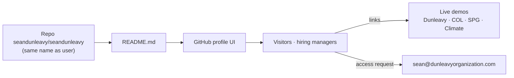

# seandunleavy (GitHub profile) — Architecture

**Last updated:** 2026-08-12  
**Type:** GitHub special profile README (not an application)  
**Related:** [PORTFOLIO.md](../PORTFOLIO.md) · [PROJECT_PLAN.md](../PROJECT_PLAN.md) · [README.md](../README.md)

---

## Purpose

This repository exists so GitHub shows a **profile landing page** when someone visits [github.com/seandunleavy](https://github.com/seandunleavy). There is no server process, pipeline, or deploy to phenom.

---

## System overview

**GitHub rule:** A public repo named **exactly** as the username, with a root `README.md`, becomes the profile README.

---

## Content architecture

| Section in README | Role |
|-------------------|------|
| Intro + badges | Who / stack signals |
| Hiring managers box | Private-repo access policy + contact |
| Featured projects | Short cards with live links and stack lines |
| (optional future) | Skills matrix, contribution highlights — keep scannable |

**Source of truth for deep case studies:** each product’s `PORTFOLIO.md` and company project pages — not this README alone.

---

## What is out of scope

- Application code  
- Secrets, deploy scripts, or phenom paths  
- Duplicating full architecture of every product  

---

## File anchors

| Concern | File |
|---------|------|
| Profile content | `README.md` |
| Maintenance plan | `PROJECT_PLAN.md` |
| Case study framing | `PORTFOLIO.md` |
